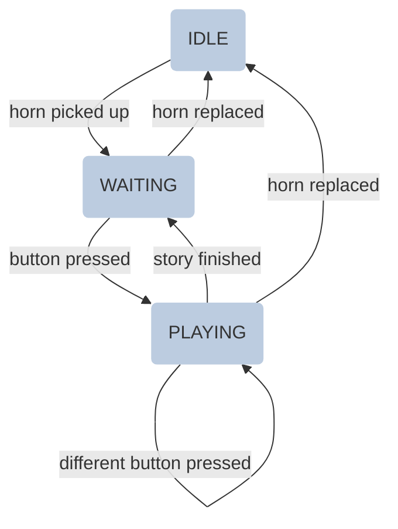

# WONDERfull Stories

WONDERfull Stories is a fork of [Echoes of Tomorrow](https://github.com/basbaccarne/echoes-of-tomorrow), but
drops the live remote-server conversation. Pick up the horn, and one of four
buttons plays you a different prerecorded story. Let it finish and the phone
hangs itself up; press another button any time and it switches straight to
that story instead.

Each of the four phones is set apart by a DIP switch and can hold four
completely different stories (sixteen in total) across the installation, all
running fully standalone with no server, network, or LLM involved.

## How it works

1. **Idle** — handset on the hook. The booth breathes a slow amber glow, and
   roughly once an hour it rings itself a few times to draw attention.
2. **Waiting** — pick up the horn and a waiting sound loops (orange spinner)
   until you press a button. A voice instructs you to pick a story, and the LED ring spins in orange with a fading trail.
3. **Playing** — press button 1-4 and its prerecorded story plays (led: cream
   pulse). Each story file is a full montage: dial beep, connection sound,
   pickup, the voice, and a hang-up sound baked into its own ending — so when
   it finishes on its own, playback is done and it's straight back to
   waiting. Press a different button any time to switch stories immediately.
   Replace the horn at any point to hang up and go back to idle.



## LED ring animations
* **idle**: slow amber breathe, very dim — dormant, like embers.
* **waiting**: orange spinner with a fading trail — pick a story.
* **playing**: soft cream pulse — a story (with its own hang-up sound) is being told.

---

# Building the thing

🪛 Bill of materials (per phone, ×4 for the full installation)
| part  | count  | source |
|---|---|---|
| [Raspberry Pi 4 4GB](https://www.kiwi-electronics.com/nl/raspberry-pi-4-model-b-4gb-4268) | 1 | kiwi |
| [Power supply 27w usb-c](https://www.kiwi-electronics.com/nl/raspberry-pi-27w-usb-c-power-supply-zwart-eu-11582) | 1 | kiwi |
| [Microswitch](https://www.kiwi-electronics.com/nl/mini-microschakelaar-spdt-offset-lever-2-pack-2499) (hook switch) | 1 | kiwi |
| [Grove 6-position DIP switch](https://www.kiwi-electronics.com/nl/grove-6-position-dip-switch-20587) | 1 | kiwi |
| [Led ring](https://www.kiwi-electronics.com/nl/grove-rgb-led-ring-16-ws2813-mini-10313) | 1 | kiwi |
| [Flat arcade button](https://www.gotron.be/componenten/schakelmateriaal/schakelaars-en-drukknoppen/arcade-knoppen/lichtgevende-arcade-drukknop-30mm-wit.html) | 4 (one per story) | gotron |
| [3.5mm jack telephone horn](https://www.amazon.com.be/-/en/Bright-Mobile-Professional-Anti-Radiation-Computers/dp/B0CP17NRHM) | 1 | amazon |
| [3.5mm jack to USB dongle](https://www.amazon.com.be/dp/B08B1KK54P) | 1 | amazon |
| [Adafruit I2S 3W Class D Amplifier — MAX98357A](https://www.adafruit.com/product/3006) | 1 | mouser |
| [3W 8Ω speaker](https://www.dfrobot.com/product-1506.html) | 1 | mouser |
| SD card 32gb (fast) | 1 | gotron |
| Male to female jumper wires | ~12 | gotron |

## Setting up the Raspberry Pi

**1. Wiring**

|component|wiring|
|---|---|
| **DIP switch** | 3.3V (red), ground (black), SDA/GPIO2 (white), SCL/GPIO3 (yellow) |
| **LED ring** | 5V (red), ground (black), data → GPIO10 (yellow) |
| **horn (hook) button** | GPIO17 and GROUND |
| **story button 1** | GPIO27 and GROUND |
| **story button 2** | GPIO22 and GROUND |
| **story button 3** | GPIO24 and GROUND |
| **story button 4** | GPIO23 and GROUND |
| **I²S amp (ring speaker)** | LRC → GPIO19 (blue), BCLK → GPIO18 (yellow), DIN → GPIO21 (green), GND → GROUND (black), Vin → 5V (red) |
| **USB telephone horn (earpiece)** | USB |
| **power** | USB-C |

<div align="left">
 
</div>

* Connect the speaker to the amp
* Configure the SD card (Pi OS lite is fine)
* Attach power

**2. Software**
1. Initialize the Pi & `sudo apt update && sudo apt upgrade -y`
2. Install packages — `sudo apt install git i2c-tools python3-pip python3-rpi.gpio -y`
3. Clone this repo — `git clone https://github.com/basbaccarne/wonder26 /home/pi/wonder26`
4. Install python libraries — `pip install pyyaml gpiozero smbus2 adafruit-circuitpython-neopixel adafruit-blinka --break-system-packages` (for Pi 5 use `Adafruit-Blinka-Raspberry-Pi5-Neopixel` instead of `adafruit-circuitpython-neopixel`)
5. Enable I²C in `raspi-config`
6. Configure I²S audio (see [this readme](/tests/speaker/I2S.md))
7. Allow shutdown
    ```bash
    sudo visudo
    ```
    Add this line at the end:
    ```ini
    pi ALL=(ALL) NOPASSWD: /usr/sbin/shutdown
    ```
8. Set your phone ID via the DIP switch (switch 1 ON = phone 0, switch 2 ON = phone 1, switch 3 ON = phone 2, switch 4 ON = phone 3)
9. Drop your story `.wav` files into `audio_files/` — see [audio_files/README.md](/audio_files/README.md) for the exact filenames expected
10. Install the service
    ```bash
    sudo cp services/wonder26.service /etc/systemd/system/
    sudo systemctl daemon-reload
    sudo systemctl enable wonder26.service
    sudo systemctl start wonder26.service
    ```

The same repo and service file are deployed unchanged to all four phones —
only the DIP switch position differs.

## Logging
```bash
sudo python3 -u src/main.py 2>&1 | tee ~/wonder_log.txt
```
Or, once running as a service:
```bash
tail -f /home/pi/log.log
```

## Hardware tests
* [`tests/button/button.py`](/tests/button/button.py) — verify the horn and all four story buttons
* [`tests/DIP_switch/read.py`](/tests/DIP_switch/read.py) — verify the DIP switch reads correctly
* [`tests/ledring/demo.py`](/tests/ledring/demo.py) — verify the LED ring
* [`tests/speaker/I2S.md`](/tests/speaker/I2S.md) — set up the I²S amp + ring speaker
